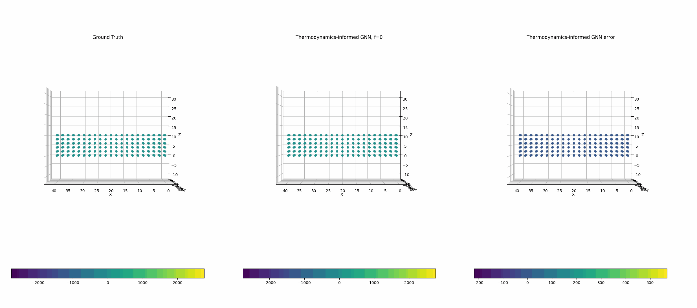
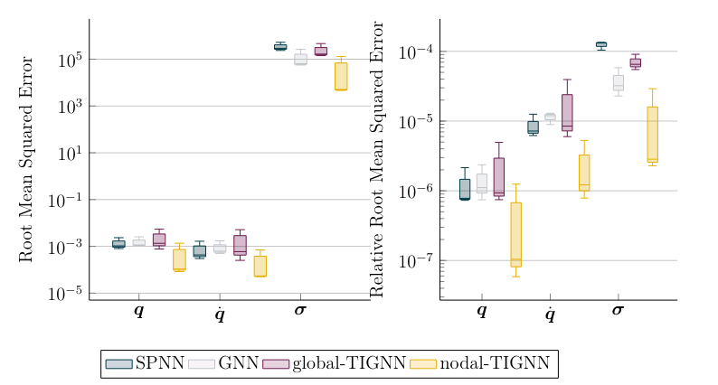

<div align="center"> 

# Graph neural networks informed locally by thermodynamics

*Alicia Tierz, Iciar Alfaro, David González, Francisco Chinesta, and Elías Cueto*

[](https://amb.unizar.es/people/alicia-tierz/)
[](https://arxiv.org/pdf/2405.13093)

</div>

## Abstract
Thermodynamics-informed neural networks employ inductive biases for the enforcement of the first and second principles of thermodynamics. To construct these biases, a metriplectic evolution of the system is assumed. This provides excellent results, when compared to uninformed, black box networks. While the degree of accuracy can be increased in one or two orders of magnitude, in the case of graph networks, this requires assembling global Poisson and dissipation matrices, which breaks the local structure of such networks. In order to avoid this drawback, a local version of the metriplectic biases has been developed in this work, which avoids the aforementioned matrix assembly, thus preserving the node-by-node structure of the graph networks. We apply this framework for examples in the fields of solid and fluid mechanics.  Our approach demonstrates significant computational efficiency and strong generalization capabilities, accurately making inferences on examples significantly different from those encountered during training.

For more information, please refer to the following:

- Tierz, Alicia and Alfaro, Iciar and González, David and Chinesta, Francisco and Cueto, Elías. "[Graph neural networks informed locally by thermodynamics](https://ieeexplore.ieee.org/document)." IEEE Transactions on Artificial Intelligence (2024).


<div align="center">

</div>


## Methodology

### Key Features:
- **Physics-Informed Bias**: Incorporates the GENERIC formalism for thermodynamic consistency.
- **Local Implementation**: Maintains the local structure of GNNs to improve computational scalability.
- **Encode-Process-Decode Architecture**: Implements a multi-layer perceptron-based pipeline for processing nodal and edge features.

### Supported Scenarios:
- Solid Mechanics: Simulates viscoelastic beam bending in both 2D and 3D.
- Fluid Mechanics: Models fluid sloshing with dynamic particle-based connectivity.


## Results

- Example rollout for the 3D viscoelastic beam bending:

  


- Box plot comparing the relative RMSE and RRMSE error for the 3D viscoelastic beam bending. The yellow box represents the performance of our method (Local TIGNN):


   


## Installation

1. Clone the repository:
   ```bash
   git clone https://github.com/a-tierz/Local-ThermodynamicsGNN.git
   cd Local-ThermodynamicsGNN
   ```

2. Install dependencies:
   ```bash
   pip install -r requirements.txt
   ```

3. Install and initialize Weights & Biases:
   ```bash
   pip install wandb
   wandb init
   ```


## Usage

Run the training script for any of the examples, only the beam3D dataset is provided in the repository, if you need more send a email to atierz@unizar.es:
```bash
python main_train.py --dset_name dataset_Beam3D.json
```

Replace `data/jsonFiles/dataset_Beam3D.json` with the appropriate configuration file for your experiment.

### Test pretrained nets
```bash
python main_inference.py --dset_name dataset_Beam3D.json --pretrain_weights modelTest_3DBeam.ckpt
```


## Citation

If you use this code or datasets in your research, please cite:

```bibtex
@misc{tierz2024graphneuralnetworksinformed,
      title={Graph neural networks informed locally by thermodynamics}, 
      author={Alicia Tierz and Iciar Alfaro and David González and Francisco Chinesta and Elías Cueto},
      year={2024},
      eprint={2405.13093},
      archivePrefix={arXiv},
      primaryClass={cs.LG},
      url={https://arxiv.org/abs/2405.13093}, 
}
```
### License

This repository is licensed under the GNU License. See `LICENSE` for details.

---

For any questions or feedback, please contact **Alicia Tierz** at atierz@unizar.es